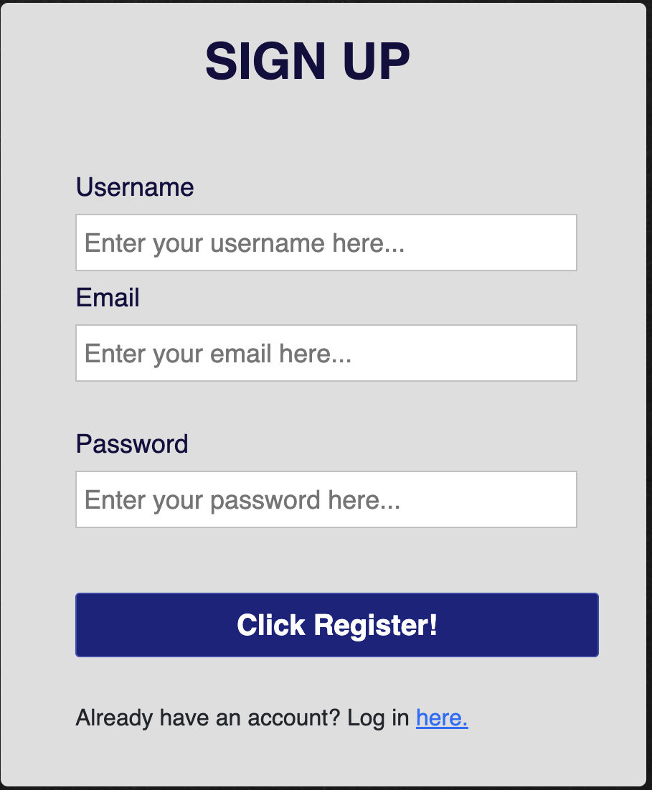
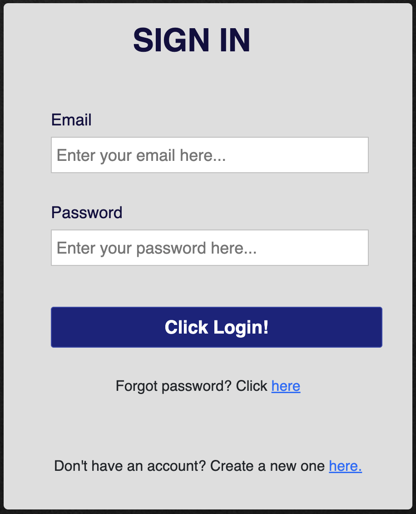
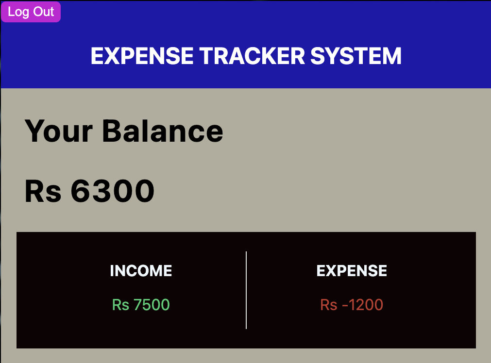
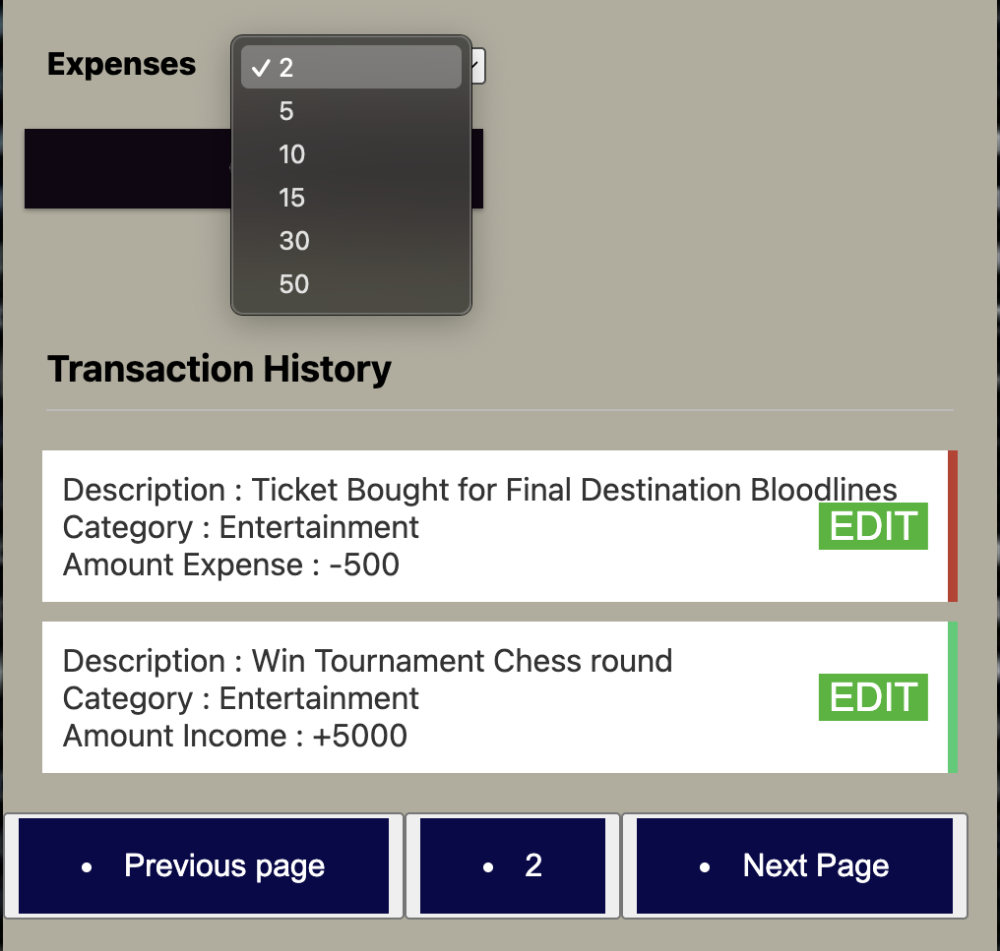
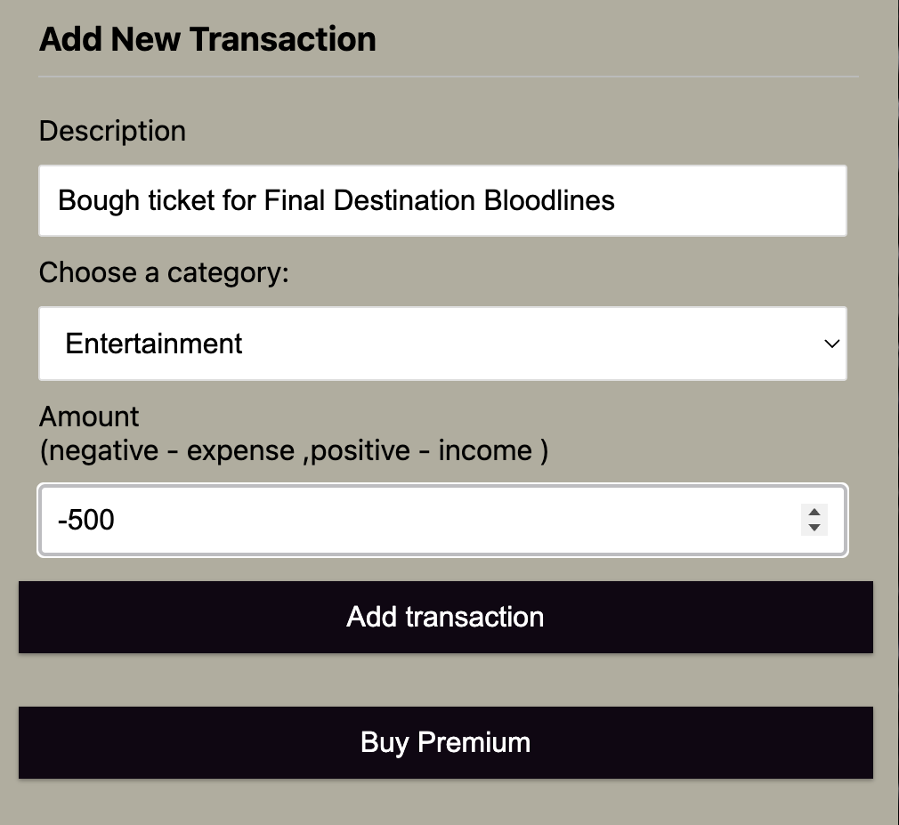
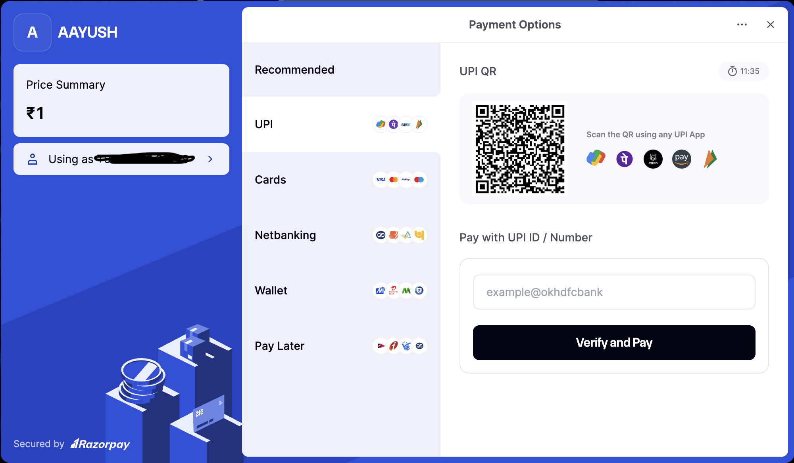
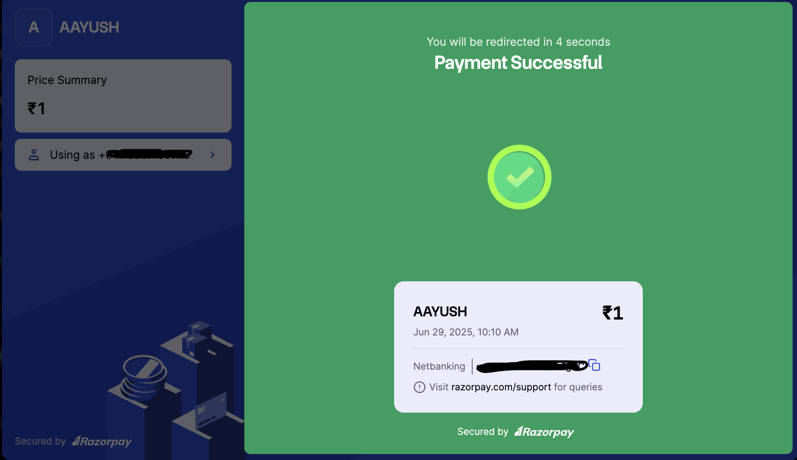
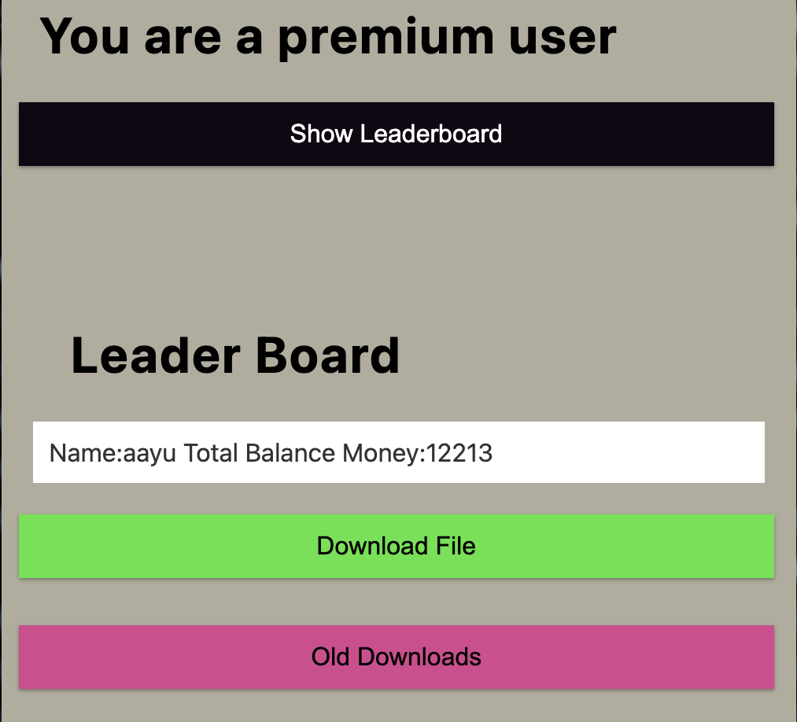

# Income-Expense-Tracker-App

Income-Expense-Tracker project has been made with Node.js, Express.js and MongoDb Atlas database. This Web-application contains features like:

- User can Login and Sign-up with token generating using jsonweb token library for the Authentication purpose
- User can add, remove and edit expense/income details of their own only, because of Authentication provided.
- Integrated Razorpay Payment Gateway system to give users, the advantage of Premium features
- Premium-Membership features includes download the pdf of expense/incomes report, added Leaderboard Table to see Balance money of other users

## Tech Stack

**Frontend:** HTML, CSS, Javascript

**Backend:** Node, Express

**Database:** MongoDB, AWS RDS

**Libraries:** Bcrypt, Aws-sdk, uuid, http, dotenv

**Cloud System:** EC2 instance, S3-Bucket, Nginx, Jenkins

## To Run Application Locally

```bash
  $ git clone https://github.com/kaayush163/MongoDB-IncomeExpense-Tracker-WebAPP.git
```

```bash
  $ cd MongoDB-IncomeExpense-Tracker-WebAPP
```

```bash
  $ npm i
```

```bash
  $ Change url of mongodb atlas link with Username and Password in app.js file
```

```bash
  $ npm start
```

## Screenshots

|                       Sign Up                        |                       Sign In                        |
| :--------------------------------------------------: | :--------------------------------------------------: |
|  |  |

|            Dashboard(Displaying Inc/Exp)             |                  Dynamic Pagination                  |
| :--------------------------------------------------: | :--------------------------------------------------: |
|  |  |

|               Add Transaction Section                |     Razopay Dashoard(BuyPremium Button Clicked)      |
| :--------------------------------------------------: | :--------------------------------------------------: |
|  |  |

|                  Payment Successful                  |           Premium User 3 features provided           |
| :--------------------------------------------------: | :--------------------------------------------------: |
|  |  |
